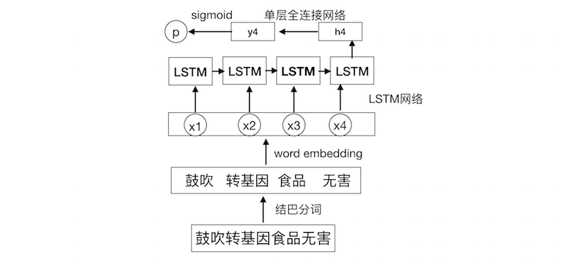

# 任务说明
训练两个分类器，分别识别句子内容中是否包含民族主义或者是民粹主义。

# 模型说明
下面以民族主义为例子

首先对输入的句子结巴分词，然后将分词后的每个单词转换成词向量
输入到LSTM循环神经网络中，取网络的最后一个隐藏层节点，
这个节点就可以看成是整个句子的一个深层次的表示，将这个表示送入一个
全联接的单层神经网络中，并经过sigmoid函数，就能获得p，这个p就是这个句子
是民族主义的概率

# 数据说明
`data/nationalism`目录下是民族主义的数据

`dev.txt`表示开发集数据，`trian.txt`表示训练集数据，`test.csv`表示测试集数据

其中，开发集和测试集数据，格式是 标签+文本(标签为1，表示正样本，具有民族主义情绪)

测试集数据，格式是 文本id+文本

`data/populism`目录下是民粹主义的数据，数据格式与上面的民族主义一致

## 数据集大小

民族主义

| 数据集 | 正样本 | 负样本 | 总量|
| :------:| :------:  | :------:  |:---:|
|trian|30458|31940|62398|
| dev |7541|8059|15600|
|test| -| -|19471|

民粹主义

| 数据集 | 正样本 | 负样本 | 总量|
| :------:| :------:  | :------:  |:---:|
|trian|26457|31942|58399|
| dev |6543|8057|14600|
|test| -| -|19471|

# 实验
模型的超参数

| 超参数 | 值 |
| :------:| :------:  |
|字典大小 | 10000|
|一个batch的句子数|  32|
|词向量维度|  100|
|LSTM隐藏层大小 | 256|
|学习率 |0.01|
|优化算法|Adam|

实验在训练数据集上训练数据，每隔100个batch，在验证集上验证当前分类器的准确率。

保存在验证集上最高准确率的模型参数，并用这个模型在测试集上做预测。

# 引用
如果本数据集和代码应用到了你工作中，请引用下面这篇文章:

《民族主义和民粹主义极端情绪的表达：基于新浪微博上转基因议题的研究》

